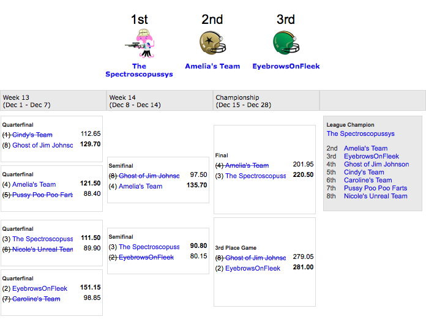
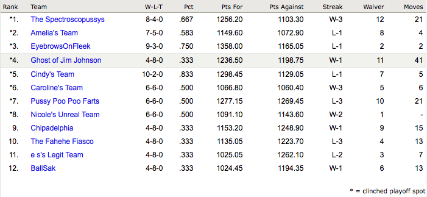
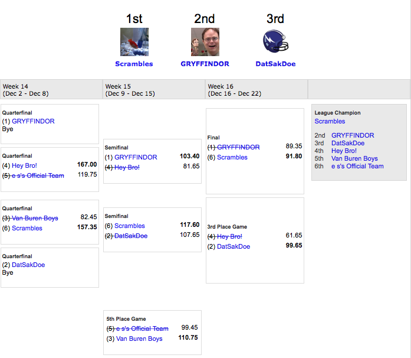
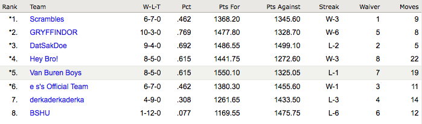
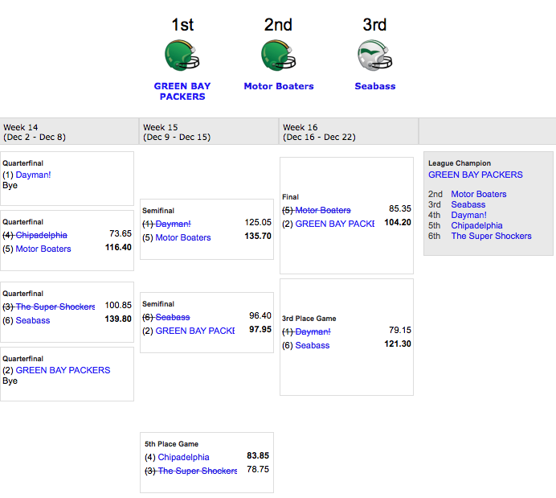
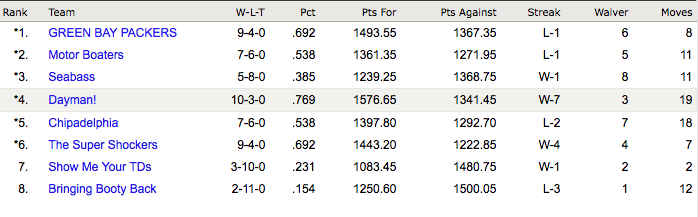
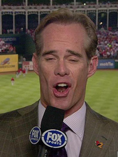
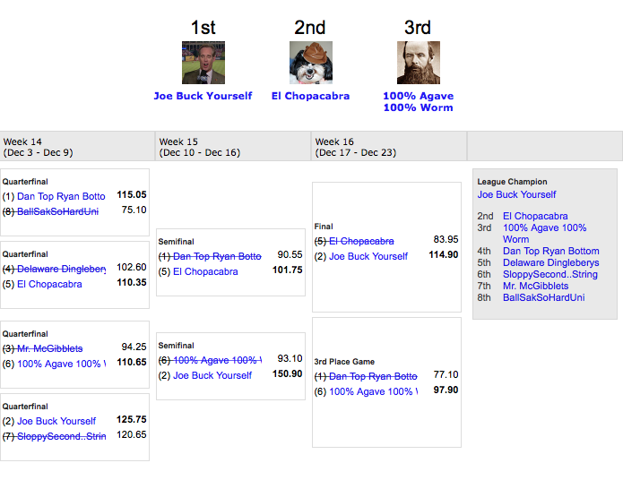
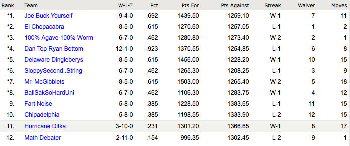

Fantasy Football Archives
=========================

This humble README will act as the written archive of Fantasy Football league results. Indeed, Yahoo keeps track of this sort of thing, but because these results span different leagues I thought it would be more convenient to pull them all together here.

Contents
========

1. [List of Fantasy Football Super Bowl Champions](#fantasy-football-super-bowl-championships)
2. [All-time records by owner](#all-time-records-by-owner)
3. [2016 Season](#2016-season)
4. [2015 Season](#2015-season)
5. [2014 Season](#2014-season)
  1. [Yuengling Conference](#yuengling-conference)
  2. [Cheesesteak Conference](#cheesesteak-conference)
6. [2013 Season](#2013-season)
7. [Notes](#notes)

Fantasy Football Super Bowl Championships
=========================================

| Championship | Date              | League                     | Winning Team              | Owner        | Score           | Losing Team   | Owner        |
|--------------|-------------------|----------------------------|---------------------------|--------------|-----------------|---------------|--------------|
| I            | December 23, 2013 | The Bourbon Ball League    | **Joe Buck Yourself**     | **Cindy**    | 114.90 - 83.95  | El Chopacabra | Jess         |
| II           | December 22, 2014 | Yuengling Conference       | **Scrambles**             | **Jess**     |  91.80 - 89.35  | GRYFFINDOR    | Sam Widmayer |
| III          | December 22, 2014 | Cheesesteak Conference     | **GREEN BAY PACKERS**     | **Andrew**   | 104.20 - 85.35  | Motor Boaters | Kevin Archer |
| IV           | December 28, 2015 | Dick G. Yuengling's League | **The Spectroscopussys**  | **Nick Nak** | 220.50 - 201.95 | Amelia's Team | Amelia       |
| V            | December 26, 2016 | Dick G. Yuengling's League | **SportsScience**         | **Steve**    | 133.50 - 121.00 | Br&#228;u Brahs | Dan        |

All-time records by owner
=========================

| Owner     | W-L   | Frac. | Postseason W-L | Frac. | # Championships |
|-----------|-------|-------|----------------|-------|-----------------|
| Jess      | 25-26 | 0.490 | 7-2            | 0.778 | **1**           |
| Cindy     | 22-16 | 0.578 | 3-1            | 0.750 | **1**           |
| Andrew    | 20-18 | 0.526 | 3-1            | 0.750 | **1**           |
| Nick Nack |  8-4  | 0.666 | 3-0            | 1.000 | **1**           |
| Dan       | 25-26 | 0.490 | 2-5            | 0.285 | 0               |
| Steve     | 16-22 | 0.421 | 1-1            | 0.500 | 0               |
| Ryan      | 18-19 | 0.486 | 3-3            | 0.500 | 0               |
| Eric      | 16-22 | 0.421 | 1-4            | 0.200 | 0               |
| Lauren    | 19-19 | 0.500 | 1-4            | 0.200 | 0               |
| Brian     | 17-9  | 0.654 | 2-3            | 0.400 | 0               |
| Kevin     |  9-17 | 0.346 | 2-1            | 0.667 | 0               |
| Amelia    |  7-5  | 0.583 | 2-1            | 0.667 | 0               |
| Sam       | 22-4  | 0.846 | 3-3            | 0.500 | 0               |
| Owen      |  5-8  | 0.385 | 2-1            | 0.667 | 0               |
| Josh      | 12-14 | 0.462 | 1-2            | 0.333 | 0               |
| Randy     |  1-12 | 0.077 | -              | -     | 0               |

2016 Season
===========
The second year of the Dick G. Yuengling league featured a return to the (far better) one-week championship game format. Also, for the first time, we retained the same league with all of the same owners. ALSO, this marks the second year in a row that the QB combo of Russell Wilson and Captain Kirk Cousins guided a team through the championship. Incredible.

Champion - SportsScience (Steve)
--------------------------------

| Player             | Pos. | Team | Points |
|--------------------|------|------|--------|
| Russell Wilson     | QB   | SEA  | 330.25 |
| Kirk Cousins       | QB   | WAS  | 386.45 |
| Ezekiel Elliott    | RB   | DAL  | 314.40 |
| Jordan Howard      | RB   | CHI  | 222.10 |
| Mark Ingram        | RB   | NO   | 205.20 |
| Tyrell Williams    | WR   | SD   | 156.90 |
| Tyreek Hill        | WR   | KC   | 156.00 |
| Jordan Matthews    | WR   | PHL  | 101.40 |
| Randall Cobb       | WR   | GB   | 91.30  |
| John Brown         | WR   | ARI  | 67.70  |
| Kyle Rudolph       | TE   | MIN  | 129.00 |
| Coby Fleener       | TE   | NO   | 90.30  |
| Graham Gano        | K    | CAR  | 138.00 |
| Cairo Santos       | K    | KC   | 134.00 |
| Philadelphia       | DEF  | PHL  | 154.00 |

2015 Season
===========
The inagural year of the Dick G. Yuengling league was hastily put together the day before the first game of the season. Saw new comers: Amelia and Nick Nack. It should also be noted that this year we tried a two-week championship round where the final championship game (and consulation game) spaned the last two weeks of the fantasy season. This was weird and sucked.

Champion - The Spectroscopussys (Nick Nack)
-------------------------------------------

| Player                | Pos. | Team | Points |
|-----------------------|------|------|--------|
| Russell Wilson        | QB   | SEA  | 387.5  |
| Kirk Cousins          | QB   | WAS  | 366.1  |
| Adrian Peterson       | RB   | MIN  | 254.7  |
| Darren Sproles        | RB   | PHI  | 106.50 |
| Javorius Allen        | RB   | BAL  |	103.7  |
| Tim Hightower         | RB   | NO   | 77.40  |
| Brandin Cooks	        | WR   | NO   |	181.6  |
| James Jones           | WR   | SD   |	150.0  |
| Ted Ginn Jr.   		| WR   | CAR  | 142.9  |
| Julian Edelman        | WR   | NE   | 114.5  |
| DeSean Jackson        | WR   | WAS  | 77.8   |
| Malcom Floyd          | WR   | SD   | 72.1   |
| Jordan Cameron        | TE   | MIA  | 56.6   |
| Adam Vinatieri        | K    | IND  | 118.0  |
| Pittsburgh            | DEF  | PIT  | 167.0  |

### Playoff Results

### Final Standings

2014 Season
===================
Becasue we didn't want to have a 14-man league in 2014 we split the league into two conferences: Yuengling Conference and Cheesesteak Conference. This wasn't actually a great idea, as having 8-man leagues made getting good players too easy. Additionally it meant Jess and I were in each of the two conferences, which wasn't fun.

Yuengling Conference
--------------------

### Champion - Scrambles (Jess)

| Player                | Pos. | Team | Points |
|-----------------------|------|------|--------|
| Matt Ryan             | QB   | ATL  | 366.20 |
| Matt Asiata           | RB   | MIN  | 150.20 |
| Eddie Lacy            | RB   | GB   | 242.60 |
| Joique Bell           | RB   | DET  | 164.20 |
| Giovani Bernard       | RB   | CIN  | 147.90 |
| Trent Richardson      | RB   | IND  |  90.80 |
| Demaryius Thomas      | WR   | DEN  | 262.90 |
| Anquan Boldin         | WR   | SF   | 139.60 |
| Alshon Jeffery        | WR   | CHI  | 185.60 |
| Cordarrelle Patterson | WR   | MIN  |  63.10 |
| Terrance Williams     | WR   | DAL  | 110.10 |
| Travis Kelce          | TE   | KC   | 119.20 |
| Adam Vinatieri        | K    | IND  | 153.00 |
| Seattle               | DEF  | SEA  | 147.00 |
| St. Louis             | DEF  | STL  | 153.00 |

### Playoff Results

### Final Standings

Cheesesteak Conference
----------------------

### Champion - GREEN BAY PACKERS (Andrew)

| Player                | Pos. | Team | Points |
|-----------------------|------|------|--------|
| Ben Roethlisberger    | QB   | PIT  | 397.70 |
| Tom Brady             | QB   | NE   | 343.15 |
| Matt Forte            | RB   | CHI  | 256.60 |
| Eddie Lacy            | RB   | GB   | 242.60 |
| Steven Jackson        | RB   | STL  | 124.50 |
| Jordy Nelson          | WR   | GB   | 253.90 |
| Randall Cobb          | WR   | GB   | 217.40 |
| Cordarrelle Patterson | WR   | MIN  |  63.10 |
| Mohamed Sanu          | WR   | CIN  | 130.05 |
| Golden Tate           | WR   | DET  | 175.10 |
| Coby Fleener          | TE   | IND  | 131.40 |
| Dwayne Allen          | TE   | IND  |  87.50 |
| Adam Vinatieri        | K    | IND  | 153.00 |
| Detroit               | DEF  | DET  | 132.00 |
| Houston               | DEF  | HOU  | 174.00 |

### Playoff Results

### Final Standings

2013 Season
===================
The inagural year of the Fantasy Football Super Bowl era saw new comers: Andrew, Cindy, Jess.

Champion - Joe Buck Yourself (Cindy)
----------------------------

| Player            | Pos. | Team | Points |
|-------------------|------|------|--------|
| Matthew Stafford  | QB   | DET  | 365.40 |
| Nick Foles        | QB   | PHL  | 303.05 |
| Matt Forte        | RB   | CHI  | 278.30 |
| DeMarco Murray    | RB   | DAL  | 214.40 |
| Darren Sproles    | RB   | NO   | 105.40 |
| Dez Bryant        | WR   | DAL  | 211.40 |
| Eric Decker       | WR   | DEN  | 207.80 |
| Brian Hartline    | WR   | MIA  | 131.60 |
| Alshon Jeffery    | WR   | CHI  | 215.60 |
| Roddy White       | WR   | ATL  |  93.10 |
| Charles Clay      | TE   | MIA  | 122.40 |
| Dan Carpenter     | K    | BUF  | 148.00 |
| Stephen Gostokski | K    | NE   | 177.00 |
| Cleveland         | DEF  | CLE  | 114.00 |
| Green Bay         | DEF  | GB   | 108.00 |

Playoff Results
---------------

Final Standings
---------------

Notes
=====
Blah.
